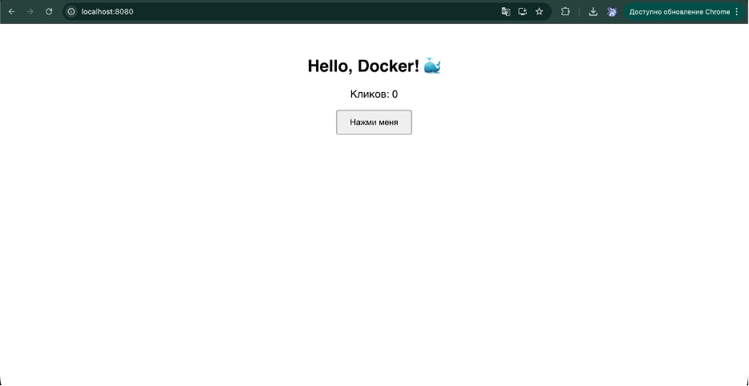

# Lab Itog: React + Docker Multi-Stage

Простое React-приложение (счётчик кликов), упакованное в Docker-образ с двухэтапной сборкой.  
Первый этап собирает статику на `node:alpine`, второй раздаёт её через `nginx:alpine`.

## Скриншот


## Сборка Docker-образа
```bash
docker build -t lab3-react-app .

